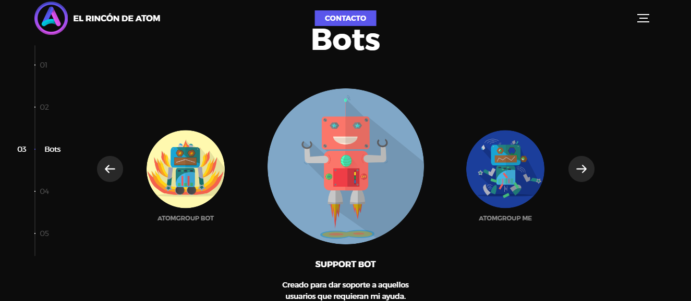
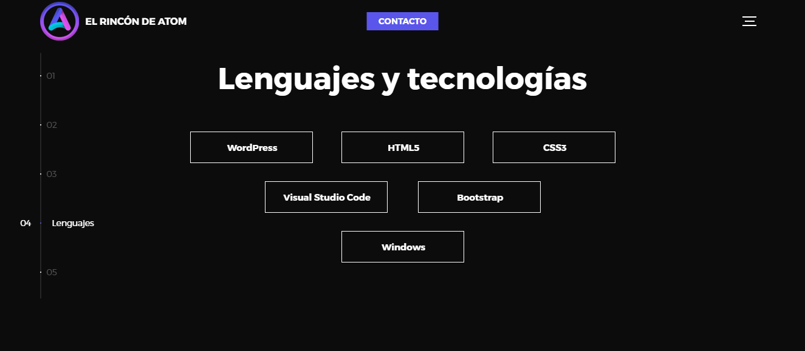
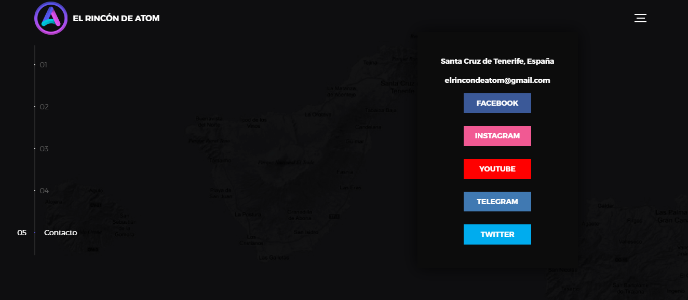

Landing page usando la plantilla:
### [Global: HTML5 website template](http://buckymaler.com/global)
https://darkwebsite-atom.netlify.app/

Global es una plantilla de sitio web sencilla, moderna y elegante diseñada para profesionales de la industria creativa. Puede servir como un portafolio de una sola página o modificarse fácilmente para servir como el comienzo perfecto para una agencia creativa moderna.

Este proyecto a sido desarrollado con HTML5, Sass, jQuery, and Hammer.js.

Se cubren los conceptos básicos de rendimiento: los activos se minifican en archivos CSS y JS únicos, y las imágenes se optimizan.

---

Capturas de pantalla

---

---

---

---

---

### Hola, [AtomWhyred][website] por aquí 

 [][tlg]

---
### LOVE - DEV - TELEGRAM

- 🔭 Actualmente me estoy superando para ser un gran desarrollador.
- 👯 Estoy colaborando en varios grupos y canales en Telegram.
- ⚡ Me gusta: estudiar, programación, android, linux y las criptomonedas.
- 📫 Correo: elrincondeatom@gmail.com

---

<!-- Links -->
[website]: https://elrincondeatom.com/
[tlg]: https://t.me/elrincondeatom_com
