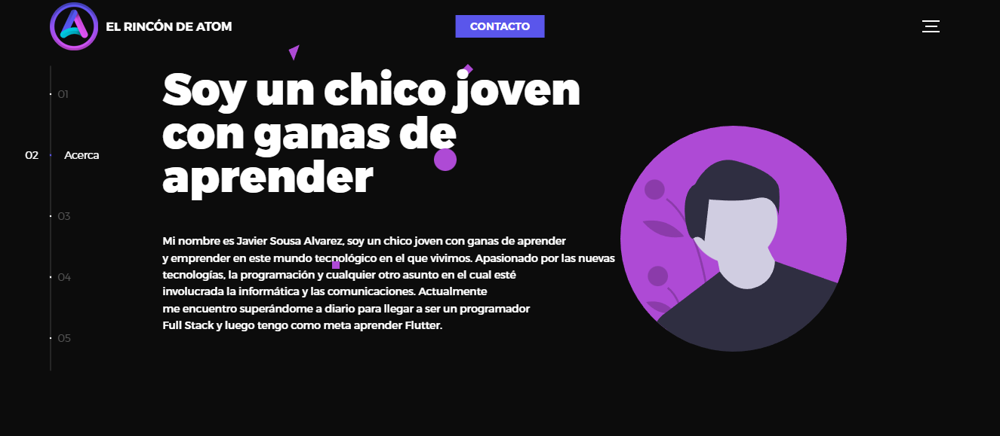

Landing page usando la plantilla:
### [Global: HTML5 website template](http://buckymaler.com/global)
https://darkwebsite-atom.netlify.app/

Global es una plantilla de sitio web sencilla, moderna y elegante diseñada para profesionales de la industria creativa. Puede servir como un portafolio de una sola página o modificarse fácilmente para servir como el comienzo perfecto para una agencia creativa moderna.

Este proyecto a sido desarrollado con HTML5, Sass, jQuery, and Hammer.js.

Se cubren los conceptos básicos de rendimiento: los activos se minifican en archivos CSS y JS únicos, y las imágenes se optimizan.

Capturas de pantalla

---

